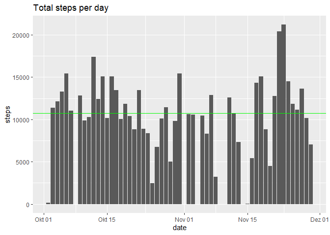
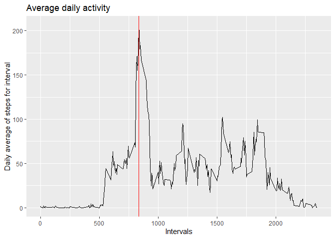
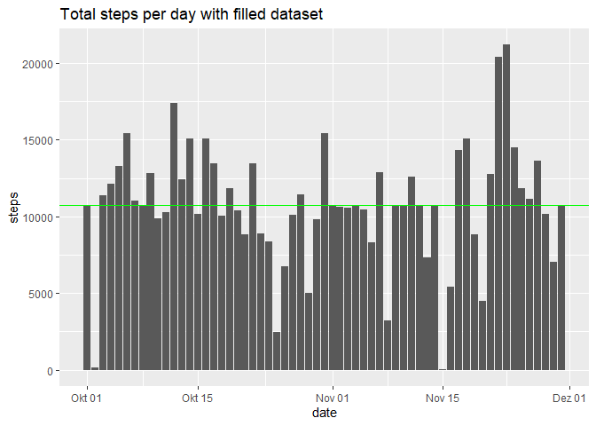
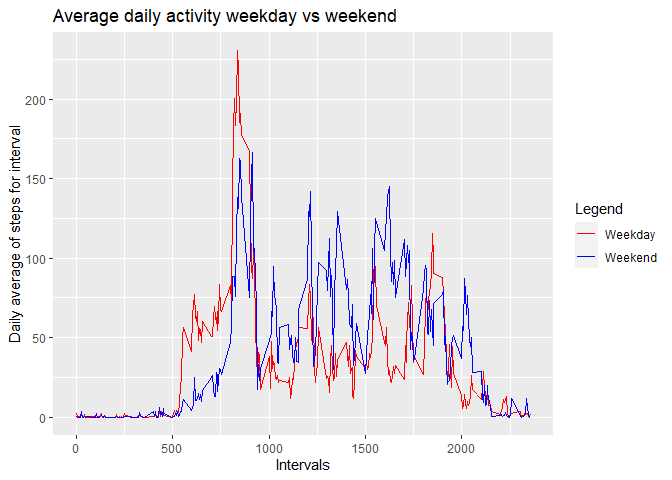

## Loading and preprocessing the data

```r
original_data <- read.csv(unzip('activity.zip'))
original_data$date <- as.Date(original_data$date, "%Y-%m-%d")
```

## What is mean total number of steps taken per day?

```r
days_factors <- factor(original_data$date)
stepsxdays <- tapply(original_data$steps, days_factors, sum)
average_steps <- mean(stepsxdays, na.rm = TRUE)
median_steps <- median(stepsxdays, na.rm = TRUE)

ggplot(data = original_data)+
  geom_bar(mapping = aes(x = date, y = steps),stat="identity")+
  ggtitle('Total steps per day')+
  geom_hline(yintercept = average_steps, col = 'red')+
  geom_hline(yintercept = median_steps, col = 'green')
```

<!-- -->

```r
average_steps
```

```
## [1] 10766.19
```

```r
median_steps
```

```
## [1] 10765
```


## What is the average daily activity pattern?

```r
interval_factors <- factor(original_data$interval)
stepsxinterval <- tapply(original_data$steps[!is.na(original_data$steps)], interval_factors[!is.na(original_data$steps)], mean)
max_steps <- which.max(stepsxinterval)

ggplot()+
  geom_line(mapping = aes(x = unique(original_data$interval), y = as.numeric(stepsxinterval)))+
  ggtitle('Average daily activity')+
  xlab('Intervals') + ylab('Daily average of steps for interval')+
  geom_vline(xintercept = unique(original_data$interval)[max_steps], col = 'red')
```

<!-- -->

```r
max_interval <- unique(original_data$interval)[max_steps]
```
 
The 5-minute interval that contains the maximum number of steps on average across all the days in the dataset is:

```r
max_interval
```

```
## [1] 835
```

## Imputing missing values


```r
#total number of missing values
total_missing_values <-sum(is.na(original_data$steps))
#new dataset with the missing data filled in
new_data <- original_data
for (i in 1:dim(original_data)[1]) {
  if (is.na(original_data$steps[i]) == TRUE) {
    new_data$steps[i] <- stepsxinterval[as.character(original_data$interval[i])]
  }
}
#Plot
stepsxdays_new <- tapply(new_data$steps, days_factors, sum)
average_steps_new <- mean(stepsxdays_new, na.rm = TRUE)
median_steps_new <- median(stepsxdays_new, na.rm = TRUE)
ggplot(data = new_data)+
  geom_bar(mapping = aes(x = date, y = steps),stat="identity")+
  ggtitle('Total steps per day with filled dataset')+
  geom_hline(yintercept = average_steps_new, col = 'red')+
  geom_hline(yintercept = median_steps_new, col = 'green')
```

<!-- -->

```r
#Variation
delta_average_steps <- average_steps_new - average_steps
delta_median_steps <- median_steps_new - median_steps
```

The new mean is:

```r
average_steps_new
```

```
## [1] 10766.19
```
and the variation compared to previous mean is:

```r
delta_average_steps
```

```
## [1] 0
```

The new median is:

```r
median_steps_new
```

```
## [1] 10766.19
```
and the variation compared to previous median is:

```r
delta_median_steps
```

```
## [1] 1.188679
```

## Are there differences in activity patterns between weekdays and weekends?


```r
#New factor variable
for (i in 1:dim(new_data)[1]) {
  if (weekdays(new_data$date[i]) == 'Samstag' | weekdays(new_data$date[i]) == 'Sonntag') {
    new_data$dayofweek[i] <- 'weekend'
  } else {
    new_data$dayofweek[i] <- 'weekday'
  }
}

dayofweek_factors <- factor(new_data$dayofweek)
split_data <- split(new_data, dayofweek_factors)

final_data <- data.frame(matrix(ncol = 2, nrow = 288))
colnames(final_data) <-  c('weekend','weekday')
for (j in c('weekend','weekday')){
  interval_factors <- factor(split_data[[j]]$interval)
  final_data[j] <- tapply(split_data[[j]]$steps, interval_factors, mean)
}

ggplot()+
  geom_line(mapping = aes(x = unique(original_data$interval), y = final_data$weekday,color='Weekday'))+
  geom_line(mapping = aes(x = unique(original_data$interval), y = final_data$weekend,color='Weekend'))+
  ggtitle('Average daily activity weekday vs weekend')+
  xlab('Intervals') + ylab('Daily average of steps for interval')+
  scale_color_manual(name='Legend',
                     breaks=c('Weekday', 'Weekend'),
                     values=c('Weekday'='red', 'Weekend'='blue'))
```

<!-- -->


